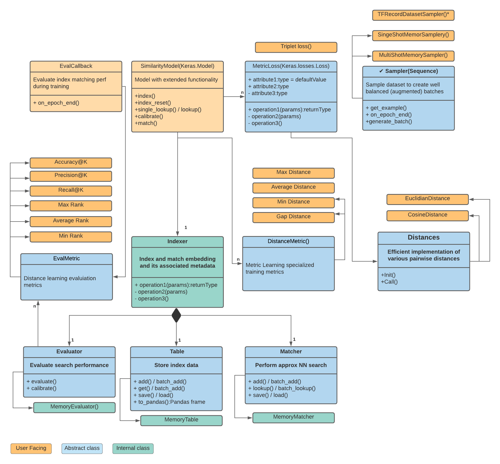

# TensorFlow Similarity: Metric Learning for Humans

TensorFlow Similarity is a [TensorFLow](https://tensorflow.org) library focused
on making metric learning easy. TensorFlow similarity is still in beta version
with some features, such as semi-supervised not yet implementd.


## Introduction

Tensorflow Similarity offers state-of-the-art algorithms for metric learning and
all the needed components to research, train, evaluate and serve models
that learn from similar looking examples. With it you can quickly and easily:

- Train and serve model that allow to find similar items, such as images,
from large indexes.

- Perform semi-supervised or self-supervised training to
train/boost classification models when you have a large corpus with
few labeled examples. **Not yet available**.

### Supervised models

Metric learning objective function is different from traditional classification:

- *Supervised models* learn to output a metric embeddings (1D float tensor)
that exhibit the property that if two examples are close in the real world,
their embeddings will be close in the
projected [metric space](https://en.wikipedia.org/wiki/Metric_space).

Representing items by their metrics embeddings allow to build
indexes that contains "classes" that were not seen during training,
add classes to the index without retraining, and only requires
to have a few examples per classes both for training and retriving.
This ability to operate on few examples per class is sometime
refered as few-shot learning in the litterature.

What makes retrieving similar items from the index very efficient is that
metric learning allows to use [Approximate Nearest Neighboors Search](https://en.wikipedia.org/wiki/Nearest_neighbor_search) to perform the search on the embedding times in sublinear
time instead of using the standard [Nearest Neighboors Search](https://en.wikipedia.org/wiki/Nearest_neighbor_search) which take a quadratic time.

In practice TensorFlow Similarity built-in `Index()` by leveraging
the [NMSLIB](https://github.com/nmslib/nmslib) can find the closest items
in a fraction of second even when the index contains over 1M elements.


- **Self-supervised contrastive model** help train more accurate models by
peforming a large-scale pretraining that aim at learning a consistent
representation of the data by "contrasting" different representation of
the same example generated via data augmentation and/or contrasting the
representation of different examples to separate then. Then the model is
fine-tuned on the few labeled examples like any classification model.
**This part is still a work in progress**

Overall Tensorflow Similarity well-tested composable components
follow Keras best practices to ensure they can be seamlessly integrated
into your TensorFlow workflows and get you results faster whether you
are doing research or building innovative products.

## What's new

- August 2021 (v0.13.x): Added many new contrastives losses
including Circle Loss, PNLoss, LiftedStructure Loss and
Multisimilarity Loss.

For previous changes - see the [changelog -- Fixme](FIXME)

## Getting Started

### Installation

Use pip to install the library

```python
pip install tensorflow_similarity
```

### Documentation

The detailed and narrated notebooks are a good way to get started
with TensorFlow Similarity. There is likely to be one that is similar to
your data or your problem (if not, let us know). You can start working with
the examples immediately in Google Colab by clicking the Google colab icon.

For more information about specific functions, you can [check the API documentation -- FIXME]()


## Supported Algorithms


### Supervised learning

| name         | Description |
| -----------  | ----------- |
| Triplet Loss |             |
| PN Loss      |             |
| Multi Loss   |             |
| Circle Loss  |             |


## Package components



TensorFlow Similiarity, as visible in the diagram above, offers the following
components to help research, train, evaluate and serve metric models:

- **`SimilarityModel()`**: This class subclasses the `tf.keras.model` class and extends it with additional properties that are useful for metric learning. For example it adds the methods:
  1. `index()`: Enables indexing of the embedding
  2. `lookup()`: Takes samples, calls predict(), and searches for neighbors within the index.

- **`MetricLoss()`**:  This virtual class, that extends the `tf.keras.Loss` class, is the base class from which Metric losses are derived from. This subclassing ensures proper error checking, i.e., ensures the user is using a loss metric to train the models, perform better static analysis, and enforces additional constraints such as having a distance function that is supported by the index. Additionally, Metric losses make use of the fully tested and highly optimized pairwise distances functions provided by TF Similarity that are available under the `Distances.*` classes.

- **`Samplers()`**: Samplers are meant to ensure that each batch has at least n (with n >=2) examples of each class, as losses such as TripletLoss can’t work properly if this condition is not met. TF similarity offers an in-memory sampler for small dataset and a TFRecordDatasets for large scales one.

- **`Indexer()`**: The Indexer and its sub-component are meant to index known embeddings alongside their metadata. The embedding metadata is stored within `Table()`, while the `Matcher()` is used to perform [fast approximate neighboor searches](https://en.wikipedia.org/wiki/Nearest_neighbor_search) that are meant to quickly retrieve the indexed elements that are the closest to the embeddings supplied in the `lookup()` and `single_lookup()` function.
The `Evaluator()` component is used to compute EvalMetrics() on the specific index for evaluation and calibration purpose.

The default `Index()` sub-compoments run in-memory and are optimized to be used in interactive settings such as jupyter notebooks, colab, and metric computation during training (e.g using the `EvalCallback()` provided). Index are serialized as part of `model.save()` so you can reload them via `model.index_load()` for serving purpose or futher training / evaluation.

The default implementation can scale up to medium deployement (1M-10M+ points) easily provided the computers used have enough memory. For very large scale deployement you will need to sublcass the compoments to match your own architetctue. See FIXME colab to see how to deploy TF simialrity in production.


For more information about a given component head to the [API documentation](FIXME) or read [the TensorFlow Similarity paper](FIXME).


## Citing

Please cite this reference if you use any part of TensorFlow similarity
in your research:

```bibtex
@article{EBSIM21,
  title={TensorFlow Similarity: A Usuable, High-Performance Metric Learning Library},
  author={Elie Bursztein, James Long, Shun Lim, Owen Vallis, Francois Chollet},
  journal={Fixme},
  year={2021}
}
```

## Disclaimer

This is not an official Google product.
