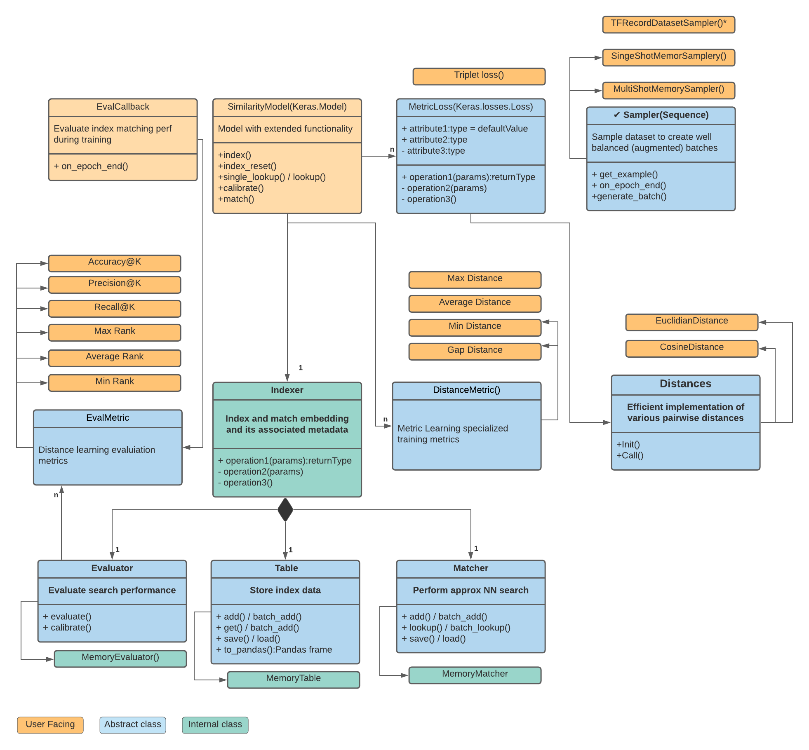

# TensorFlow Similarity API Documentation

TensorFlow Similarity is a TensorFlow library focused on making metric learning easy

TensorFlow Similiarity, as visible in the diagram above, offers the following
components to help research, train, evaluate and serve metric models:

- **`SimilarityModel()`**: This class subclasses the `tf.keras.model` class and
  extends it with additional properties that are useful for metric learning. For
  example it adds the methods: 1. `index()`: Enables indexing of the embedding
  2. `lookup()`: Takes samples, calls predict(), and searches for neighbors
  within the index.  3. `calibrate()`: Calibrates the model's index search
  thresholds using a calibration metric and a test dataset.

- **`MetricLoss()`**:  This virtual class, that extends the `tf.keras.Loss`
  class, is the base class from which Metric losses are derived. This
  sub-classing ensures proper error checking; that is, it ensures the user is
  using a loss metric to train the models, performs better static analysis, and
  enforces additional constraints such as having a distance function that is
  supported by the index. Additionally, Metric losses make use of the fully
  tested and highly optimized pairwise distances functions provided by
  TensorFlow Similarity that are available under the `Distances.*` classes.

- **`Samplers()`**: Samplers are meant to ensure that each batch has at least n
  (with n >=2) examples of each class, as losses such as TripletLoss can’t work
  properly if this condition is not met. TensorFlow Similarity offers an
  in-memory sampler for small dataset and a `tf.data.TFRecordDataset` for large
  scales one.

- **`Indexer()`**: The Indexer and its sub-components are meant to index known
  embeddings alongside their metadata. The embedding metadata is stored within
  `Table()`, while the `Matcher()` is used to perform [fast approximate neighbor
          searches](https://en.wikipedia.org/wiki/Nearest_neighbor_search) that
  are meant to quickly retrieve the indexed elements that are the closest to the
  embeddings supplied in the `lookup()` and `single_lookup()` function.

The default `Index()` sub-compoments run in-memory and are optimized to be used
in interactive settings such as Jupyter notebooks, Colab, and metric computation
during training (e.g using the `EvalCallback()` provided). Index are serialized
as part of `model.save()` so you can reload them via `model.index_load()` for
serving purpose or further training / evaluation.

The default implementation can scale up to medium deployment (1M-10M+ points)
easily, provided the computers have enough memory. For very large scale
deployments you will need to sublcass the compoments to match your own
architetctue. See FIXME colab to see how to deploy TensorFlow Similarity in
production.

## Modules

- [`architectures`](./TFSimilarity/architectures.md): Deep-learning model architectures tweaked to work well for similarity

- [`augmenters`](./TFSimilarity/augmenters.md)

- [`callbacks`](./TFSimilarity/callbacks.md): Specialized callbacks that track similarity metrics during training

- [`classification_metrics`](./TFSimilarity/classification_metrics.md): Classification metrics measure matching classification quality between a

- [`distances`](./TFSimilarity/distances.md): Vectorized embedding pairwise distances computation functions

- [`evaluators`](./TFSimilarity/evaluators.md): Evaluates search index performance and calibrates it.

- [`indexer`](./TFSimilarity/indexer.md): Index the embeddings infered by the model to allow distance based

- [`layers`](./TFSimilarity/layers.md): Specialized Similarity `keras.layers`

- [`losses`](./TFSimilarity/losses.md): Contrastive learning specialized losses.

- [`matchers`](./TFSimilarity/matchers.md): Matchers define the classification matching strategy when using

- [`models`](./TFSimilarity/models.md): Specialized `keras.model.Model` subclasses that offers additional

- [`retrieval_metrics`](./TFSimilarity/retrieval_metrics.md): Retrieval metrics measure the quality of the embedding space given a

- [`samplers`](./TFSimilarity/samplers.md): Data Samplers generate balanced batches for smooth training.

- [`search`](./TFSimilarity/search.md): Efficiently find nearest indexed embeddings

- [`stores`](./TFSimilarity/stores.md): Key Values Stores store the data associated with the embeddings indexed by

- [`training_metrics`](./TFSimilarity/training_metrics.md): Specialized `keras.metrics` that tracks how distances evolves during training.

- [`utils`](./TFSimilarity/utils.md): Various utilities functions for improved quality of life.

- [`visualization`](./TFSimilarity/visualization.md): Collection of specialized notebook vizualization tools

